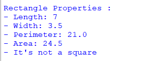

## Description
This program exhibits the 'Rectangle' class, initializing rectangle properties with default values through a constructor. It includes methods to calculate perimeter, area, and to determine if the shape is a square.
## Files
♡ [rectangle2.py](rectangle2.py) : This file contains the definition of the Rectangle class.  

♡ [main.py](main.py) : This file creates an instance of the Rectangle class and use its methods.
## Example

